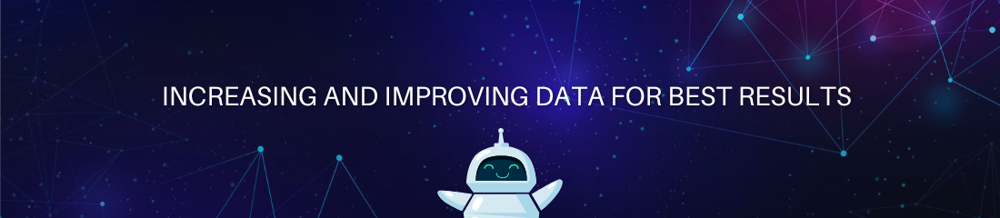

<h1 align="center">Hi 👋, I'm Gladwin George</h1>
<h3 align="center">A passionate developer from India</h3>

I'm a passionate data enthusiast on a journey to understand data, Artificial Intelligence, and Machine Learning to make wonders.

My journey involves exploring the fascinating world of AI, from theoretical concepts to practical applications.

- 📫 How to reach me **gladwingeorge189@gmail.com**

- ⚡ Fun fact **I am an introvert till you know me**

<h3 align="left">Connect with me:</h3>

<h3 align="left">Languages and Tools:</h3>

        

